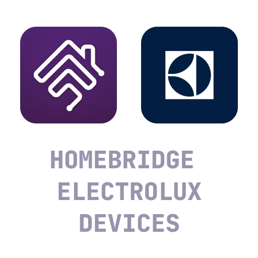

# Homebridge Electrolux Devices

This is a plugin for connecting Electrolux devices which are controlled by the [Electrolux](https://apps.apple.com/pl/app/electrolux/id1595816832) app to Homekit.

## 🧰 Installation

1. Connect all your Electrolux devices to the app and ensure you are able to control them.
2. Install this plugin using the `npm install -g homebridge-electrolux-devices` command
3. Open the Electrolux for Developers Dashboard here: https://developer.electrolux.one/login
4. Sign in using your credentials from the Electrolux app
5. Create new API Key and enter it in the plugin's configuration
6. Generate new token under "Authorization" section 
7. Copy the Refresh Token and paste it in the plugin's configuration

## 🌡️ Supported devices

-   Comfort 600 air conditioner
-   Well A5/AX 5 air purifier
-   Well A7 air purifier
-   Pure A9/AX 9 air purifier
-   UltimateHome 500 air purifier

If your device is not on the list, please create the issue. I'll be more than happy to implement the support for your device. 😄

## 🐛 Known issues

### Air conditioners

When air conditioner is set to Auto mode the maximum range value is set to 32, and the target temperature is set by changing minimum range value. If someone knows how to disable the temperature range in Auto mode, and allow to set the target temperature the same way as in Cool and Heat mode the PR will be more than welcome. :)
